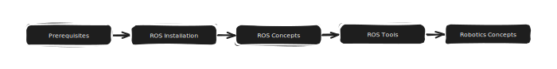

# Beginner's Guide to ROS

## Welcome

Hello there! Learning ROS for the first time may seem daunting for most, so I hope this space can serve as a guide to make the learning process more directed and newbie-friendly!

From personal experience, I struggled when learning ROS for the first time due to my lack of experience in both programming and robotics in general.

But I assure you, that with a positive attitude to learn and a lot of patience, you will find learning ROS manageable!

***

My beginner's guide to ROS will adopt the following structure/flow.

<mark style="color:orange;">**Prerequisites**</mark>

* What is Ubuntu?
* Unix Commands
* Basic Programming Knowledge with Python/C++
* Ubuntu Setup

<mark style="color:orange;">**ROS Installation**</mark>

* ROS Versions
* ROS Installation Guide (ROS2 Humble)

<mark style="color:orange;">**ROS Concepts (Beginner)**</mark>

* Nodes & Topics
* Publishers & Subscribers
* Services & Actions
* Launch Files & Parameters
* ROS File Structure & How to Write Packages

<mark style="color:orange;">**ROS Tools/Utilities**</mark>

* Data Inspection
  * `rqt, rqt_graph`
* Data Recording&#x20;
  * `ros2 bags`

<mark style="color:orange;">**Fundamental Robotics Concepts**</mark>

* Key Domains In Robotics Software
  * Perception
  * Localisation
  * Controls
  * Navigation
  * Simulation
* Fundamentals
  * Rotation/Quaternions
  * Rigid Body Transformations
  * Coordinate Frames
  * Costmaps
  * SLAM
  * Basic Control Theory
  * Basic Image Processing

***
