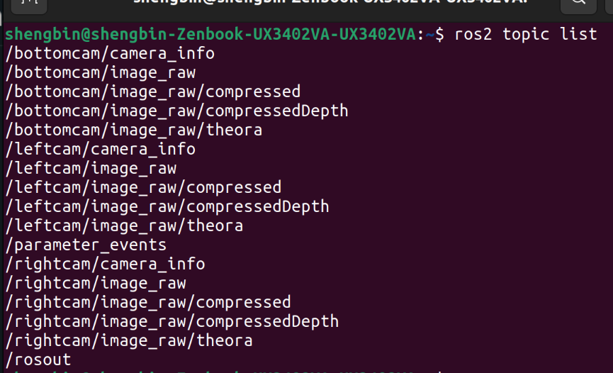

# Image Pipeline

The image\_pipeline package fills the gap between getting raw images from a camera driver and higher-level vision processing.\
For more info about image\_pipeline: [http://wiki.ros.org/image\_pipeline](http://wiki.ros.org/image\_pipeline)

***

**Hardware Requirements**\
The image pipeline will work with any conforming ROS camera driver node.\
A ROS camera driver node should have the minimal requirements:

* Publishing topics ("/image\_raw" and "/camera\_info")
* Have the following service ("set\_camera\_info")

<figure><figcaption>
Topics published by ROS Camera Driver Node (eg. v4l2_camera_driver)
</figcaption></figure>

<figure><figcaption>
Minimal requirements of ROS camera driver nodes
</figcaption></figure>

